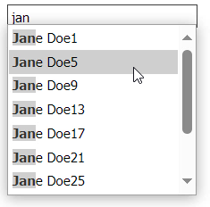

<!-- default badges list -->

<!-- default badges end -->
# Token Box for ASP.NET Web Forms - How to bind the control to a large data source
This example demonstrates how to bind the [ASPxTokenBox](https://docs.devexpress.com/AspNet/16295/components/data-editors/tokenbox) control to a large data source on the client side.

## Overview

The client-side [KeyUp](https://docs.devexpress.com/AspNet/js-ASPxClientTextEdit.KeyUp) event occurs after a user enters a character in the token box. In this example, this event's handler performs the following actions when 3 or more characters are entered:

1. Clears the control's token collection.
2. Searches the data source for items that include the entered text.
3. Populates the token box with found items.

Once a user selects a token, the [TokensChanged](https://docs.devexpress.com/AspNet/js-ASPxClientTokenBox.TokensChanged) event occurs. The event handler clears the token collection and hides the control's drop-down window.

Note that some code sections in this example are enclosed in the [BeginUpdate](https://docs.devexpress.com/AspNet/js-ASPxClientComboBox.BeginUpdate) - [EndUpdate](https://docs.devexpress.com/AspNet/js-ASPxClientComboBox.EndUpdate) method calls. These methods allow event handlers to process a batch of changes in token box settings without intermediate updates. You can disable the [AllowCustomTokens](https://docs.devexpress.com/AspNet/DevExpress.Web.ASPxTokenBox.AllowCustomTokens) property and change the [IncrementalFilteringDelay](https://docs.devexpress.com/AspNet/DevExpress.Web.ASPxAutoCompleteBoxBase.IncrementalFilteringDelay) property value to adapt this example to your business requirements.

## Files to Review

* [Default.aspx](./CS/Default.aspx) (VB: [Default.aspx](./VB/Default.aspx))
* [Default.aspx.cs](./CS/Default.aspx.cs) (VB: [Default.aspx.vb](./VB/Default.aspx.vb))

## Documentation

- [Bind Editors to Data](https://docs.devexpress.com/AspNet/3787/components/data-editors/common-concepts/binding-to-data?p=netframework)
<!-- feedback -->
## Does this example address your development requirements/objectives?

 

(you will be redirected to DevExpress.com to submit your response)
<!-- feedback end -->
